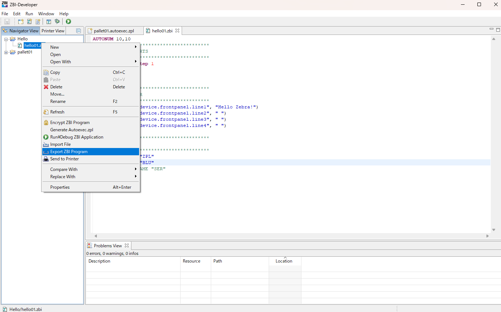
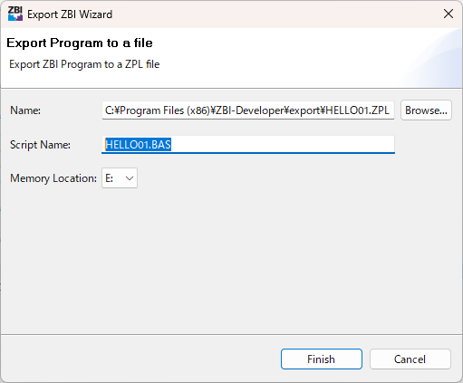
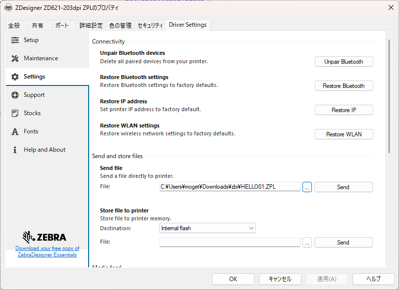
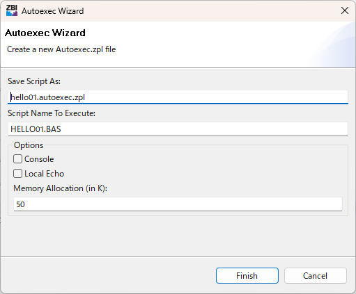

## Zebra-Printer_How-to-Start-ZBI-Guide-for-Beginners
## ZBI 初心者ガイド（概要）

各手順、プリンタの初期設定、ZBIコードの詳細については別途マニュアルを参照すること。

</br>

### プリンタの初期設定

1. プリンタを工場出荷状態に戻す。


    [Link-OS プリンタを工場出荷状態に戻す方法](https://github.com/shimauma-giken/Zebra-Printer_Factory-Reset-Link-OS-Printer#link-os-%E3%83%97%E3%83%AA%E3%83%B3%E3%82%BF%E3%82%92%E5%B7%A5%E5%A0%B4%E5%87%BA%E8%8D%B7%E7%8A%B6%E6%85%8B%E3%81%AB%E6%88%BB%E3%81%99%E6%96%B9%E6%B3%95)

1. 利用サプライが利用できるように、プリンタの初期設定をする。
    - 用紙の設定
    - 通信設定

### ZBIの設定

1. ZBIをActivateする。

    [Activating ZBI (Zebra Basic Interpreter) Article ID:000015434  •  February 15, 2022](https://supportcommunity.zebra.com/s/article/Activating-and-deactivating-ZBI-Zebra-Basic-Interpreter?language=en_US)

### ZBIコーディング

1. ZBI Developersをインストールする。

    [ZBI Developer Download](https://www.zebra.com/us/en/support-downloads/software/printer-software/zebra-basic-interpreter-zbi.html)

1. ZBI DeveloperでZBIコードを開発する。

    ZBIの開発に関する情報は[ZPLプログラミングガイド](https://www.zebra.com/content/dam/support-dam/en/documentation/unrestricted/guide/software/zpl-zbi2-pg-en.pdf)を熟読すること。

### ZBIインストーラ作成

1. ZBI インストーラ（ZPLファイル）を作成する。

    ```
    "ZBIファイル"を右クリック > "Export ZBI Program"
    ```

    


1. インストール先情報を入力する。

    

    |項目|説明|
    |------|---------|
    |Name| インストーラの保存先（ローカルPC）|
    |Script Name | プリンタに保存するファイル名（*.BAS) |
    |Momory Location    | "E"を選択すること

### ZBIをプリンタにインストール


1. 下記ファイルをZebra Setup Utilities(ZSU)を用いてプリンタに送信する。
    ```
    "Open Printer Tools" > Settings > Send File (作成したファイルを選択) > Send
    ```
    

1. インストールの可否は下記コマンドで確認が可能。
    ```
    ! U1 do "file.dir" "E"
    "
    - DIR E:*.*
    ...
    * E:ANMDJ.TTF  22927536
    * E:FONTXU_FIXED.FNT      6919
    * E:GOTHIC24.FNT    536450
    * E:HELLO01.BAS       800 ★
    * E:IPAG.TTF   6235344
    ...

    -   2203648 bytes free E: ONBOARD FLASH    
    ```


### ZBIの実行


1. プリンタにインストールされたZBIを実行する。

    ```
    構文、
     ^XA^JIE:[filename],N,N,50K^FS^XZ
    
    例、
     ^XA^JIE:HELLO01.BAS,N,N,50K^FS^XZ

     ```

    - 液晶メニューからの実行でもOK。

     ```
    "メニュー" > "システム" > "プログラム言語" > "言語" > (インストールしたBASファイルを選択し、実行)
     ```


1. 実行したZBIの検証をする。

</br>

### [Tips] 常時ZBIを実行する場合の設定

1. Autoexecのインストーラを作成する。

    ```
    "ZBIファイル"を右クリック > "Generate Autoexec.zpl"
    ```
    

    |項目|説明|
    |------|---------|
    |Name| インストーラの保存先（ローカルPC）|
    |Script Name | 実行するZBIファイル名（*.BAS) |
    |Console    | メモリ使用容量。わからないときはデフォルト値のままにしておく |

1. 作成されたZPLファイルをZSUでプリンタに送信。

1. Autoexecファイルのインストールを確認。
    ```
    ! U1 do "file.dir" "E"
    "
    - DIR E:*.*
    * E:ANMDJ.TTF  22927536
    * E:AUTOEXEC.ZPL        35　★
    * E:BQ.BAS      2168
    ...
    ```

1. プリンタを再起動し、ZBIが実行されることを確認します。

</br>

### [Tips] ZBI関連ファイルの削除

プリンタによって、削除方法が異なるため詳細は割愛するが、概ね下記いずれかの手順となる。詳細は各プリンタ機種のユーザーズガイドなどの関連場を確認すること。

1. 液晶付きモデル

    1. 液晶から、ZBIを停止し、Autoexec/BASファイルを削除する。

1. 液晶無しモデル

    1. Autoexec非実行モードをプリンタを起動し、Autoexec/BASファイルを削除する。

</br>

### [Tips] 実機を用いたデバッグ、リアルタイム動作確認

ZBIの最終動作チェックは実機を用いて実施することが推奨される。下記では未使用ポート（シリアル）を用いる方法を説明する。

1. ゼブラプリンタとシリアル接続をする。

    [参考：ZebraプリンタとWindows PCをシリアル接続する方法](https://github.com/shimauma-giken/Zebra-Printer_Connect_to-Printer-from-Windows-Laptop-via-Serial-Connection)

1. 下記サンプルコマンドを参考にデバッグを実施する。各コマンドの詳細についてはZPLプログラミングマニュアルを参照すること。

    </br>


    ```
    ; 事前にZBI-Developerで構文確認をしておくこと。


    ; ZBIモードに移行
    ~JI

    ; 新規コードの登録
    NEW

    ; コードを入力
    10 PRINT "HELLO WORLD"

    ; 登録されたコード一覧
    LIST
    10 PRINT "HELLO WORLD"

    ; 実行
    > RUN
    HELLO WORLD

    ; 要所要所の確認ポイントではPRINTなどで確認したい値などを出力確認すること。
    ; エラー発生時は行番号が表示されるので、前後や関連処理のコードを確認すること。

    ; ZPLモードに戻る
    >ZPL


以上